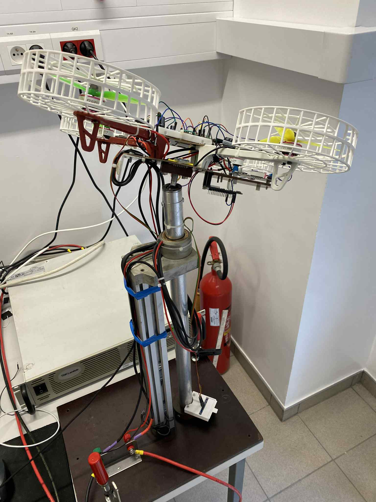
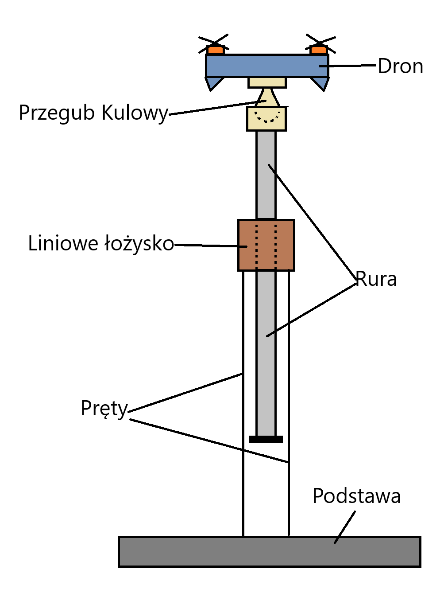

# 🚀 Drone Control System – Master Project

**Quadcopter 4DOF Experimental Control Platform**  
_Master’s Thesis Project by [Michał Rogulski](https://github.com/MRogul)_

---

## 🧩 Overview

This repository presents the **design and implementation of a drone control system** developed as part of a Master’s Thesis at the **Warsaw University of Technology**.  
The project focuses on the creation of a **4 Degrees of Freedom (4DOF) quadrotor test stand**, combining simulation, embedded programming, and real-world experiments.

### 🛠️ The system enables testing of:
- Attitude and altitude control (**Roll**, **Pitch**, **Yaw**, **Z**)
- Sensor fusion using **Complementary** and **Kalman filters**
- Real-time **PID tuning** via ESP8266 web interface
- Live data visualization in **STM32CubeMonitor**

---

## 📸 Real Test Stand

| Final Stand | Initial Concept |
|:------------:|:----------------:|
|  |  |
| **4DOF Research Stand (Final version)** | **Initial design of the test rig** |

---

## ⚙️ Project Highlights

✨ **Modular Embedded Design**  
Built on STM32L432KC microcontroller, with independent PID loops for all four DOF.

🎛️ **Real-Time Control & Monitoring**  
Wi-Fi tuning via ESP8266 and data acquisition using STM32CubeMonitor.

🧠 **Sensor Fusion**  
Complementary and Kalman filters used for attitude estimation based on IMU (Bosch BNO055).

🔬 **Experimental Validation**  
Validated on a custom-built 4DOF test rig enabling safe, repeatable lab experiments with wired power supply.

---

## 🧠 Technologies Used

| Category | Tools |
|-----------|-------|
| Microcontroller | STM32L432KC |
| IDE | STM32CubeIDE |
| Communication | ESP8266 (Wi-Fi, Web Interface) |
| Simulation | MATLAB / Simulink |
| Visualization | STM32CubeMonitor |
| Mechanical Design | Fusion 360 / Bambu Studio |

---

## 🪶 About the Project

This project demonstrates how a **complete UAV control system** can be built from **open-source tools** and **low-cost components**, serving as a platform for research and teaching in the fields of drone dynamics, control, and embedded systems.  
The quadrotor operates on a **fixed test rig (4DOF)**, allowing precise control of rotation and altitude while ensuring safety and repeatability of experiments.

---

## 📄 License

This project is licensed under the **MIT License**.  
You are free to use and modify it for academic or research purposes.

---

**Author:** [Michał Rogulski](https://github.com/MRogul)  
🎓 Warsaw University of Technology  
📘 [Drone_Control_System_Master_Project](https://github.com/MRogul/Drone_Control_System_Master_Project)
